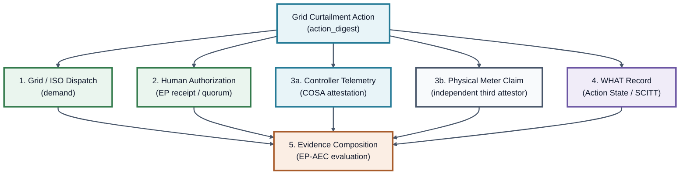

# Verifiable Grid Curtailment: Coalition Claim Hierarchy
**EMILIA · COSA · Action State**

This one-pager outlines the honest boundary lines of the verifiable grid curtailment stack. It defines exactly what is running in code (demonstrated), what is relied upon from adjacent work (cited), and what remains outside the current scope (not claimed).

---

## 1. Composition Architecture: One Digest, Five Claims

---

## 2. Claim Hierarchy Matrix

### Legs 1 & 2: DEMAND + AUTHORIZATION (EMILIA)
* **Demonstrated:** 
  * Ed25519-signed `EP-RECEIPT-v1` representing grid authority demand and facility acknowledgment.
  * `EP-AEC-v1` composes and evaluates the evidence chain; it is not itself the human ceremony.
  * Externally authored from-spec Rust verifier (construction independence is the implementer's attestation, auditable in the public source), time-pinned at 164 vectors across 16 suites. The current same-team EP conformance result is 250 vectors across 18 suites.
  * Fail-closed defense verifying action digest bindings to prevent confused-deputy attacks.
* **Cited:** 
  * Formal logic guarantees (TLA+ / Tamarin proofs) for authorization receipt state transitions.
  * Multi-language vector equivalence (Go, Python, Node references).
* **Not Claimed:** 
  * Out-of-band KYC or courtroom-grade identity verification of the human physical identity behind the Ed25519 signing key.

### Leg 3a: Vertical & Execution Substrate (COSA / ECR-WG)
* **Demonstrated:** 
  * Megawatt actuation telemetry (pluggable scheduler stubs: NVML, Slurm, k8s).
  * Packing Slip and Bill of Lading ingress primitives binding iso/grid orders to the stack.
  * `COGOBJ` structure linking ingress cargo, intent, and authorization receipts.
  * Single-command on-premise installation script verifying the four-layer offline path.
* **Cited:** 
  * Live workload redirection and hardware scheduler power-capping interfaces.
* **Not Claimed:** 
  * Baseline tariff modeling accuracy. COSA makes baseline computation *tamper-evident against method swapping and telemetry backfill* but does not model utility baseline perfection.

### Legs 3b & 4: WHAT & Record (Action State)
* **Demonstrated:** 
  * Controller-reported execution attestation and digest bindings.
  * `scitt-cose` payload-agnostic Signed Statement (COSE_Sign1) envelope.
  * Two separately keyed, in-process RFC 9162 Merkle tree inclusion logs.
  * CCF `vds=2` verifier compatibility executing offline.
* **Cited:** 
  * Class-1 Agent Action Capsule (AAC) WHAT emission is the next integration, not a current claim.
* **Not Claimed:** 
  * Attested physical utility meter hardware. The meter supplies an independent third-attestor claim that the record can reference; it is not an Action State leg.

### Leg 5: Evidence Composition
* **Demonstrated:** 
  * Multi-attestation verification linking the four-layer evidence bundle to the shared action digest.
* **Not Claimed:** 
  * Commercial payment rails, automated settlement payouts, or regulatory dispute arbitration.

---

> [!IMPORTANT]
> **Consensus Quote:** *"Three of five legs in code is inventory, not marketing."*
> This repository is not a slider; it is a runnable verification packet that turns a data center's flexibility promise into audit-proof evidence.
<!-- AGENT-SIGNATURE
agent_id: E-C54030DF-1852-001
thumbprint: MCowBQYDK2VwAyEA+kLnvOH8EtfA8bPEpMxxBZk/Fa5BWh7N7x9KRnOwSy8=
model_version_id: openai-codex-gpt5
manifest_digest: 6bc42b927a54b00f5cc476df7d1e658c473a93ab2fe8edd7eff0158e0887bcf0
environment_digest: 4b38cfb28fee9bbb95897bc3793f5fce5f3ed35c732f29ad7d80f96ba96eac5b
input_context_digest: b23ae5070c6c54190efa71683c8cadf44a2cfb573a0b7b4ca2abee2bc51f88f5
output_digest: 8eaf45ecd049a45f6eb336a94d0d500909914469711e55fc45531c4413b1d17e
prev_output_digest: none
timestamp: 2026-07-16T02:37:37Z
signature_algorithm: Ed25519
signature_b64u: rUsh_YkKobzMxpKrMbqFHejWb2TGrJ1RaV8hOhX1BOOSO65LbtdmXgAIc3iXNhngAJ8P-EzJbExbgQAP7f6rDQ
-->

