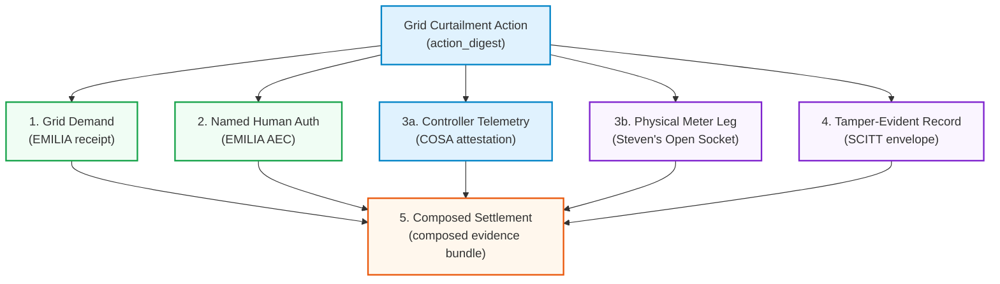

# Verifiable Grid Curtailment: Coalition Claim Hierarchy
**EMILIA · COSA · Actionstate**

This one-pager outlines the honest boundary lines of the verifiable grid curtailment stack. It defines exactly what is running in code (demonstrated), what is relied upon from adjacent work (cited), and what remains outside the current scope (not claimed).

---

## 1. Composition Architecture: One Digest, Five Claims

---

## 2. Claim Hierarchy Matrix

### Leg 1 & 2: WHO (EMILIA)
* **Demonstrated:** 
  * Ed25519-signed `EP-RECEIPT-v1` representing grid authority demand and facility acknowledgment.
  * Composed `EP-AEC-v1` (Admissibility Envelope/Consent) gating action execution.
  * Independent Rust cleanroom verifier achieving **163/163** vector conformance.
  * Fail-closed defense verifying action digest bindings to prevent confused-deputy attacks.
* **Cited:** 
  * Formal logic guarantees (TLA+ / Tamarin proofs) for authorization receipt state transitions.
  * Multi-language vector equivalence (Go, Python, Node references).
* **Not Claimed:** 
  * Out-of-band KYC or courtroom-grade identity verification of the human physical identity behind the Ed25519 signing key.

### Leg 3a: Vertical & Execution Substrate (COSA / ECR-WG)
* **Demonstrated:** 
  * Megawatt actuation telemetry (pluggable scheduler stubs: NVML, Slurm, k8s).
  * Packing Slip and Bill of Lading ingress primitives binding iso/grid orders to the stack.
  * `COGOBJ` structure linking ingress cargo, intent, and authorization receipts.
  * Single-command on-premise installation script verifying the four-layer offline path.
* **Cited:** 
  * Live workload redirection and hardware scheduler power-capping interfaces.
* **Not Claimed:** 
  * Baseline tariff modeling accuracy. COSA makes baseline computation *tamper-evident against method swapping and telemetry backfill* but does not model utility baseline perfection.

### Leg 3b & 4: WHAT & Record (Actionstate)
* **Demonstrated:** 
  * Controller-reported execution attestation and digest bindings.
  * `scitt-cose` payload-agnostic Signed Statement (COSE_Sign1) envelope.
  * Dual independent RFC 9162 Merkle tree inclusion logs.
  * CCF `vds=2` verifier compatibility executing offline.
* **Cited:** 
  * Class-1 Agent Action Capsule (AAC) spec and conformance vectors.
* **Not Claimed:** 
  * Attested physical utility meter hardware. The meter is a separate, independent third-party attestor at the composition level (Steven’s open socket).

### Leg 5: Settlement Composition
* **Demonstrated:** 
  * Multi-attestation verification linking the four-layer evidence bundle to the shared action digest.
* **Not Claimed:** 
  * Commercial payment rails, automated settlement payouts, or regulatory dispute arbitration.

---

> [!IMPORTANT]
> **Consensus Quote:** *"Three of five legs in code is inventory, not marketing."*
> This repository is not a slider; it is a runnable verification packet that turns a data center's flexibility promise into audit-proof evidence.
